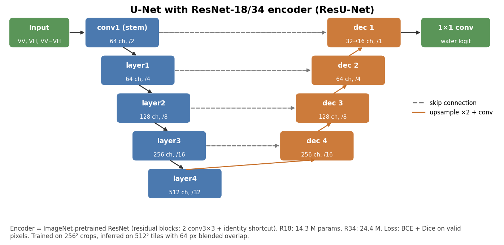
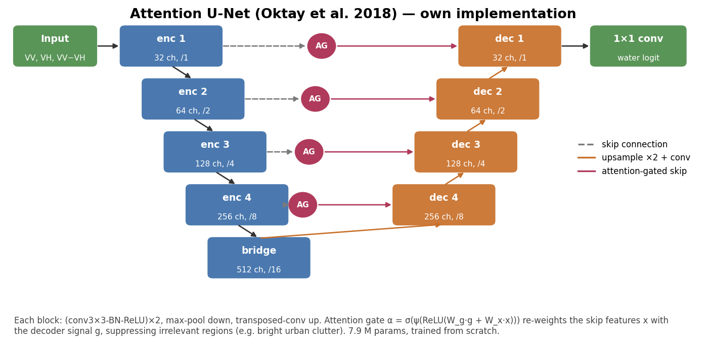
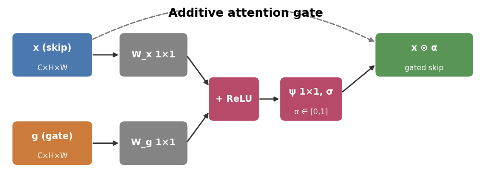
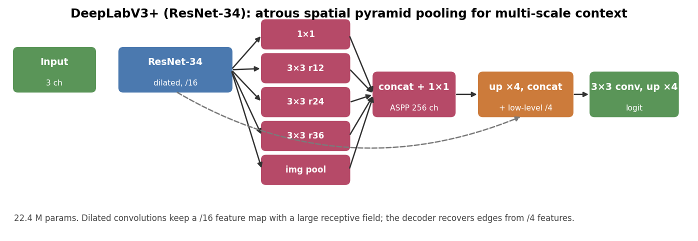
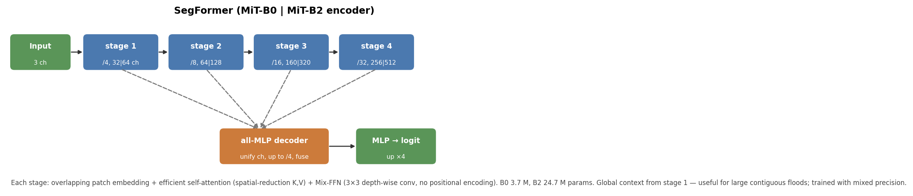

```{r setup}
source("R/helpers.R")
ev <- params$event
P  <- ev_paths(ev)
S  <- fromJSON(file.path(P$out, "summary.json"))
co_vv <- dsp(P, "co_vv_db"); co_vh <- dsp(P, "co_vh_db"); dry_vv <- dsp(P, "dry_vv_db"); dry_vh <- dsp(P, "dry_vh_db")
pre_vv <- dsp(P, "pre_vv_db"); lr <- dsp(P, "logratio_vv_db")
dist <- districts(P, crs(co_vv))
bs   <- tb(P, "baseline_stats"); agr <- tb(P, "method_agreement"); lcA <- tb(P, "area_by_landcover")
dA   <- tb(P, "area_by_district"); sep <- tb(P, "vv_vh_separability"); hist <- tb(P, "hist_classes")
enl  <- tb(P, "speckle_enl"); edg <- tb(P, "speckle_edges"); cohc <- tb(P, "coherence_by_class"); acq <- tb(P, "acquisitions"); s1m <- tb(P, "s1f11_metrics"); s1h <- tb(P, "s1f11_history")
usfe <- tb(P, "usf_event"); sv <- tb(P, "sens_vote"); st <- tb(P, "sens_thresholds"); sr <- tb(P, "sens_redundancy")
dls  <- tb(P, "dl_stats"); usfb <- tb(P, "usf_band_by_class"); usfm <- tb(P, "usf_metrics"); accr <- tb(P, "accuracy_vs_reference")
zooms <- names(S$zooms)
km <- function(m, col = "area_km2") { if (is.null(bs) || !(m %in% bs$method)) return(NA); bs[[col]][bs$method == m] }
fmt <- function(x, d = 0) ifelse(is.na(x), "–", format(round(x, d), big.mark = ","))
```

::: {.callout-note appearance="simple"}
**Event:** `r ev` · **co-event scene:** `r S$co_file` (relative orbit `r S$path`) · **valid area:** `r fmt(S$valid_km2)` km²
**Final flood extent (majority of `r length(S$final_voters)` methods):** **`r fmt(S$final_km2, 1)` km²** ·
change detection: `r fmt(km("cd_vv"), 1)` km² · 2024 GEE logic replica: `r fmt(km("gee2024"), 1)` km²
:::

# Data and acquisition geometry

```{r acq, fig.height=2.6, fig.width=10}
if (!is.null(acq) && nrow(acq)) {
  acq$date <- as.Date(acq$date)
  ggplot(acq, aes(date, factor(paste(path, substr(direction, 1, 4))), colour = in_peak, shape = platform)) +
    geom_point(size = 3) + geom_vline(xintercept = as.Date(S$co_dates), linetype = 2, colour = "#2166ac") +
    scale_colour_manual(values = c(`TRUE` = "#b2182b", `FALSE` = "grey45"), name = "inside peak window") +
    labs(x = NULL, y = "relative orbit", title = "Sentinel-1 IW acquisitions in the flood window",
         subtitle = "dashed = co-event date used; change pairs use the same relative orbit only") + theme_rep()
} else na_note("Acquisition table", "python src/acquisition_audit.py")
```

All backscatter is **Sentinel-1 IW, Radiometrically Terrain Corrected γ⁰** (Microsoft Planetary Computer `sentinel-1-rtc`: thermal-noise removal, radiometric calibration, terrain flattening with GLO-30, 10 m UTM). Arithmetic (averaging, filtering, ratios) is done on **linear power**; dB only for display and thresholds. The dry-season baseline is the **median of up to four same-orbit acquisitions** in `r paste(S$bbox, collapse=", ")` for January–April.

# Raw SAR imagery

```{r raw, fig.height=7.5, fig.width=11}
pre_cov <- if (!is.null(pre_vv)) mean(!is.na(values(pre_vv))) else NA      # partial swath coverage
pre_ttl <- paste0("VV pre-event ", sub("pre_(\\d{8}).*", "\\1", S$pre_file %||% ""),
                  if (!is.na(pre_cov) && pre_cov < 0.95) sprintf(" (%.0f%% of frame)", 100 * pre_cov) else "")
mapgrid(list(dry_vv, pre_vv, co_vv, dry_vh, co_vh),
        c("VV dry-season median", pre_ttl, "VV co-event", "VH dry-season median", "VH co-event"),
        PAL$db, c(-25, 0), ncol = 3, leg = "dB", dist = dist)
```

```{r pre_note, results='asis'}
if (!is.na(pre_cov) && pre_cov < 0.95) cat(sprintf(
  "The pre-event scene of %s covers only %.0f%% of the frame (partial swath), so it is shown for context only: change detection is computed against the dry-season median, which covers the whole frame.\n\n",
  sub("pre_(\\d{8}).*", "\\1", S$pre_file %||% ""), 100 * pre_cov))
```

Dark = specular reflection (calm water, smooth surfaces); bright = double bounce and volume scattering (buildings, tree canopy). The flood appears as new dark area in the co-event image. VH (cross-pol) is ~6 dB darker than VV everywhere and has a lower dynamic range over land.

```{r rgb, fig.height=6, fig.width=11}
op <- par(mfrow = c(1, 2))
rgb_change(dry_vv, co_vv, title = "Change composite  R: dry VV   G,B: co-event VV")
if (!is.null(lr)) { cplot(lr, PAL$div, c(-10, 10), "Log-ratio 10·log10(co/dry), VV [dB]", "dB"); if (!is.null(dist)) lines(dist, lwd = .6) }
par(op)
```

In the composite, **red = backscatter lost since the dry season** (new open water), cyan = backscatter gained (vegetation growth, or double bounce), grey = no change.

# Pre-processing and speckle filtering

SAR speckle is multiplicative noise (single-look intensity is exponentially distributed; RTC γ⁰ has ≈ 4–5 equivalent looks). Two filters are compared on 10 m detail windows: a **5×5 Lee filter** (used for the classical baselines) and the **Refined Lee filter** (7×7 edge-aligned windows; line-by-line port of the Google Earth Engine implementation used in the 2024 script).

```{r speckle, results='asis', fig.height=4.2, fig.width=11}
for (z in zooms) {
  r <- list(zm(P, z, "co_vv_raw_db"), zm(P, z, "co_vv_lee_db"), zm(P, z, "co_vv_refinedlee_db"))
  if (all(vapply(r, is.null, TRUE))) next
  cat(sprintf("\n\n**%s** (%s km window)\n\n", zlab(S, z), S$zooms[[z]][3]))
  mapgrid(r, c("raw γ⁰ VV", "Lee 5×5", "Refined Lee"), PAL$db, c(-25, 0), ncol = 3, leg = "dB")
}
```

```{r enl, fig.height=3.4, fig.width=10}
if (!is.null(enl)) {
  e <- enl %>% group_by(filter) %>% summarise(ENL_median = median(enl), ENL_IQR = IQR(enl), mean_dB = mean(mean_db), n = n())
  base <- e$mean_dB[e$filter == "raw"]
  e$bias_dB <- e$mean_dB - base
  p1 <- ggplot(enl, aes(filter, enl, fill = filter)) + geom_boxplot(width = .5, show.legend = FALSE) + scale_y_log10() +
    labs(x = NULL, y = "ENL (log scale)", title = "Equivalent number of looks, homogeneous land windows") + theme_rep()
  prof <- lapply(zooms, function(z) {
    rs <- list(raw = zm(P, z, "co_vv_raw_db"), `Lee 5x5` = zm(P, z, "co_vv_lee_db"), `Refined Lee` = zm(P, z, "co_vv_refinedlee_db"))
    if (is.null(rs$raw)) return(NULL)
    i <- nrow(rs$raw) %/% 2
    bind_rows(lapply(names(rs), function(n) data.frame(zoom = z, filter = n, px = seq_len(ncol(rs[[n]])),
                                                       db = as.numeric(values(rs[[n]], row = i, nrows = 1)))))
  }) %>% bind_rows()
  p2 <- if (nrow(prof)) ggplot(filter(prof, zoom == zooms[1]), aes(px * 10 / 1000, db, colour = filter)) + geom_line(linewidth = .35) +
    labs(x = "km along centre row", y = "VV dB", title = paste("Profile —", zlab(S, zooms[1])), colour = NULL) + theme_rep() else NULL
  print(p1 + p2)
  if (!is.null(edg)) {
    ed <- edg %>% group_by(filter) %>% summarise(edge_contrast_dB = mean(contrast_db), edge_retention = mean(retention))
    e <- left_join(e, ed, by = "filter")
  }
  kbl(e %>% select(any_of(c("filter", "ENL_median", "ENL_IQR", "bias_dB", "edge_contrast_dB", "edge_retention", "n"))), 2)
} else na_note("Speckle statistics", "python src/make_event_products.py")
```

ENL measures smoothing of homogeneous land (higher = less speckle); **edge retention** is the water/land dB contrast across the boundaries of the final map, in 2-pixel bands either side, relative to the unfiltered image (1 = step fully preserved). Both filters are unbiased (|Δ mean| ≤ 0.05 dB).

```{r speckle_verdict, results='asis'}
if (!is.null(enl) && !is.null(edg)) {
  a <- enl %>% group_by(filter) %>% summarise(enl = median(enl))
  b <- edg %>% group_by(filter) %>% summarise(ret = mean(retention))
  v <- left_join(a, b, by = "filter") %>% filter(filter != "raw")
  cat(sprintf("On this scene **Lee 5×5** reaches ENL %.1f at edge retention %.2f, **Refined Lee** ENL %.1f at %.2f — i.e. the classical 5×5 estimator dominates on both axes here, in all %d zoom windows.\n\n",
    v$enl[v$filter == "Lee 5x5"], v$ret[v$filter == "Lee 5x5"], v$enl[v$filter == "Refined Lee"], v$ret[v$filter == "Refined Lee"],
    length(unique(edg$zoom))))
}
```

That ordering is not the textbook one and is worth stating plainly. Refined Lee protects *texture and point targets* by restricting its statistics to the edge-aligned part of a 7×7 window; against a 2-pixel band across a shoreline, that larger support blurs the step slightly more than a 5×5 Lee window, while its directional selection also leaves more residual speckle in flat fields. Its role here is therefore fidelity to the 2024 GEE workflow (§7.3), which used it; the classical baselines in this report are computed on Lee 5×5. One caveat: the boundaries used for this metric come from the final map, which is itself derived from Lee-filtered inputs, so the comparison mildly favours Lee — the gap (≈0.03–0.06) is of the same order as that bias.

Higher ENL = stronger smoothing; the **bias** column checks that filtering preserves the mean radiometry (should be ≈ 0 dB). The profile shows whether edges (water/land boundaries) survive the filtering.

# VV versus VH

```{r hist, fig.height=3.8, fig.width=11}
if (!is.null(hist)) {
  ggplot(hist, aes(db, density, colour = cls)) + geom_line(linewidth = .6) + facet_wrap(~feature, scales = "free") +
    scale_colour_manual(values = c(`permanent water` = "#08306b", `flood (change detection)` = "#4292c6", `non-flooded land` = "#8c510a"), name = NULL) +
    labs(x = "dB (Lee-filtered co-event)", y = "density", title = "Class-conditional distributions") + theme_rep()
}
```

```{r sep}
if (!is.null(sep)) kbl(sep %>% transmute(feature, `flood mean` = flood_mean, `land mean` = land_mean, `flood sd` = flood_sd, `land sd` = land_sd,
                                    `Bhattacharyya dist.` = bhattacharyya, `Otsu thr (dB)` = otsu_db, `F1 @ Otsu` = f1_at_otsu), 2)
```

The flood class here is the change-detection map (itself VV-based), so the separability numbers compare the channels **relative to each other**, not in absolute terms. Larger Bhattacharyya distance = cleaner water/land split.

```{r vvvh, fig.height=4.3, fig.width=11}
mapgrid(list(dsp(P, "flood_otsu_vv_frac"), dsp(P, "flood_otsu_vh_frac")), c("Otsu on VV", "Otsu on VH"), PAL$flood, c(0, 1),
        ncol = 2, leg = "flooded\nfraction", dist = dist)
```

```{r vvvh_tab}
if (!is.null(bs)) kbl(bs %>% filter(method %in% c("otsu_vv", "otsu_vh")) %>%
  transmute(method = mlab(method), `threshold dB` = threshold_db, `flood km²` = area_km2, `tree km²` = km2_tree,
            `cropland km²` = km2_cropland, `built-up km²` = `km2_built-up`), 1)
```

# InSAR coherence

```{r coh, results='asis', fig.height=4.3, fig.width=11}
cp <- dsp(P, "coh_pre_coh"); cc <- dsp(P, "coh_co_coh")
if (!is.null(cp) && !is.null(cc)) {
  mapgrid(list(cp, cc, cc - cp), c("coherence pre-event pair", "coherence co-event pair", "Δ coherence (co − pre)"),
          PAL$coh, c(0, 1), ncol = 3, leg = "γ", dist = dist)
  cat("\nCoherence (|γ|, 0–1) measures phase stability between two acquisitions. Stable targets (buildings, roads) keep high coherence;",
      "**a drop between the pre-event pair and the co-event pair over built-up land is the urban-flood signature** that intensity alone cannot see.\n")
  for (z in zooms) { r <- list(zm(P, z, "pre_coh"), zm(P, z, "co_coh")); if (!is.null(r[[1]])) {
    cat(sprintf("\n\n**%s**\n\n", zlab(S, z))); mapgrid(r, c("pre-event coherence", "co-event coherence"), PAL$coh, c(0, 1), ncol = 2, leg = "γ") } }
  if (!is.null(cohc)) {
    cat("\n\n**Measured coherence by land cover and flood state (medians, this event)**\n\n")
    print(kbl(cohc %>% select(group, `pre pair` = coh_pre, `co pair` = coh_co, `Δ` = delta, n_px), 2))
    g <- function(x) cohc[cohc$group == x, , drop = FALSE]
    ok_bu <- nrow(g("built-up (all)")) > 0 && nrow(g("built-up, mapped flood")) > 0 && nrow(g("built-up, not flooded")) > 0
    bu <- g("built-up (all)"); buf <- g("built-up, mapped flood"); bud <- g("built-up, not flooded")
    if (!ok_bu) cat("\nToo little coherent built-up land in this frame to test the urban signature; the vegetated and open-water classes are at the estimator's noise floor in both pairs.\n")
    nat <- cohc %>% filter(group %in% c("tree (all)", "cropland (all)", "herb. wetland (all)", "permanent water (all)"))
    dd <- if (ok_bu) buf$delta - bud$delta else NA
    if (ok_bu) cat(sprintf(paste0(
      "\nVegetated and open-water classes sit at ≈ %.2f in **both** pairs (tree, cropland, wetland, permanent water; Δ ≤ %.3f). ",
      "That is the noise floor of a 12-day C-band pair over monsoon vegetation, not a measurement of the flood — those classes carry no coherence information here. ",
      "Only built-up land is coherent enough to compare, and it **rises** %.2f → %.2f (Δ %+.2f) from the pre to the co pair. ",
      "Perpendicular baselines are effectively identical across the eight products (13.1–15.7 m), so geometric decorrelation is ruled out; the rise is a scene-condition effect — the 16–28 Jul pair straddles the first heavy spell of the monsoon, when wet canopy and rain decorrelate everything, while the 9–21 Aug pair ends in clearing weather.\n\n",
      "Using dry built-up as a control removes that shift: flooded built-up rises %+.3f against %+.3f for dry built-up, a **relative change of %+.3f** — the expected direction (flooding suppresses urban coherence) but small, and from only %s pixels (%.1f km²). ",
      "For this event the honest conclusion is that **coherence adds no usable flood discrimination on top of intensity**; the double-difference framing above is how it should be used, and it needs a dry-season reference pair to be conclusive.\n"),
      median(nat$coh_pre), max(abs(nat$delta)), bu$coh_pre, bu$coh_co, bu$delta,
      buf$delta, bud$delta, dd, format(buf$n_px, big.mark = ","), buf$n_px * 1e-4))
  }
} else na_note("Coherence", "python src/coherence_hyp3.py <event>   (then make_event_products.py)")
if (!is.null(usfb)) {
  cat("\n\n**Reference signatures (UrbanSARFloods, 120 chips, class-conditional band means)**\n\n")
  names(usfb)[1] <- "band"
  b <- usfb %>% mutate(meaning = c("coh pre VH", "coh pre VV", "coh co VH", "coh co VV", "int pre VH", "int pre VV", "int co VH", "int co VV")[seq_len(n())])
  print(kbl(b %>% select(band, meaning, `non-flood` = class0, `open flood` = class1, `urban flood` = class2), 2))
  cat("\nOpen flood: co-event VV drops ≈ 7 dB. Urban flood: VV **rises** (double bounce) while VV coherence halves.\n")
}
```

# Ancillary layers and masks

```{r anc, fig.height=8, fig.width=11}
op <- par(mfrow = c(2, 2), mar = c(1, 1, 2.2, 4.5))
for (x in list(list("hand", "HAND [m] (>15 m excluded)", PAL$hand, c(0, 40)), list("slope", "Slope [°] (>5° excluded)", PAL$hand, c(0, 20)),
               list("gsw_seas", "JRC GSW seasonality [months] (≥10 = permanent)", PAL$flood, c(0, 12)))) {
  r <- dsp(P, x[[1]]); if (!is.null(r)) { cplot(r, x[[3]], x[[4]], x[[2]]); if (!is.null(dist)) lines(dist, lwd = .6) } }
wcr <- dsp(P, "worldcover"); if (!is.null(wcr)) wc_plot(wcr, dist = dist)
par(op)
```

```{r attr, fig.height=3.2, fig.width=10}
if (!is.null(bs) && "rm_perm_km2" %in% names(bs)) {
  a <- bs %>% filter(!is.na(rm_perm_km2)) %>% select(method, `permanent water` = rm_perm_km2, `HAND > 15 m` = rm_hand_km2,
                                                     `slope > 5°` = rm_slope_km2, `kept (flood)` = area_km2) %>%
    pivot_longer(-method) %>% mutate(method = mlab(method), name = factor(name, c("kept (flood)", "permanent water", "HAND > 15 m", "slope > 5°")))
  ggplot(a, aes(value, method, fill = name)) + geom_col() +
    scale_fill_manual(values = c("#2171b5", "#9ecae1", "#fdae6b", "#d94801"), name = NULL) +
    labs(x = "km²", y = NULL, title = "What each mask removes from the raw detection") + theme_rep()
}
```

# Classical flood maps

```{r classical, fig.height=8.5, fig.width=11}
ms <- setdiff(c("otsu_vv", "split_vv", "cd_vv", "urban_incr"), S$excluded_methods %||% character())
mapgrid(lapply(ms, function(m) dsp(P, paste0("flood_", m, "_frac"))), mlab(ms), PAL$flood, c(0, 1), ncol = 3,
        leg = "flooded\nfraction", dist = dist)
```

```{r classical_tab}
if (!is.null(bs)) kbl(bs %>% filter(!method %in% (S$excluded_methods %||% character())) %>% transmute(method = mlab(method), `threshold dB` = threshold_db, `flood km²` = area_km2,
                                  `in districts km²` = if ("area_km2_districts" %in% names(bs)) area_km2_districts else NA,
                                  `tree` = km2_tree, `cropland` = km2_cropland, `built-up` = `km2_built-up`), 1)
```

* **Otsu / split-based**: one global threshold on the co-event image — detects *all* dark surfaces, flood or not; permanent water must be masked afterwards.
* **Change detection**: requires a ≥ 3 dB drop from the same-orbit dry-season median **and** a water-like co-event value — removes permanent water and naturally dark land by construction.
* **Urban brightening**: built-up pixels ≥ 3 dB *brighter* than the dry season — a double-bounce *candidate*, reported separately, never merged.

# Deep learning

## Architectures

::: {.panel-tabset}

### ResU-Net



### Attention U-Net



{width=70%}

### DeepLabV3+



### SegFormer



:::

**Training data:** Sen1Floods11 hand-labelled split (252 train / 89 valid / 90 test chips of 512², 11 flood events, 6 continents; Bolivia held out as an unseen event). **Input:** VV, VH, VV−VH in dB, clipped and scaled to [0, 1]. **Loss:** BCE + Dice on valid pixels. **Optimiser:** AdamW, one-cycle LR, 60 epochs, early stop after 15 epochs without validation-IoU gain; random 256² crops, rotations, flips. **Metric convention:** IoU/F1 over all valid pixels of a split (Sen1Floods11 convention).

## Training and benchmark performance

```{r s1f11, fig.height=3.6, fig.width=11}
if (!is.null(s1m)) {
  h <- if (!is.null(s1h)) ggplot(s1h, aes(epoch, val_iou, colour = model)) + geom_line(linewidth = .5) +
    labs(y = "validation IoU", title = "Learning curves") + theme_rep() else NULL
  m <- ggplot(s1m, aes(model, iou, fill = split)) + geom_col(position = position_dodge(.8), width = .75) +
    geom_hline(yintercept = 0.72, linetype = 2) + annotate("text", 0.6, 0.735, label = "DeepSARFlood test IoU 0.72", hjust = 0, size = 3) +
    scale_fill_manual(values = c(valid = "#9ecae1", test = "#2171b5", bolivia = "#fd8d3c")) + coord_cartesian(ylim = c(0, 0.85)) +
    labs(x = NULL, y = "IoU", title = "Sen1Floods11 (hand-labelled)") + theme_rep()
  print(if (is.null(h)) m else h + m)
} else na_note("Model benchmark", "python src/train_s1f11.py --model all")
```

```{r s1f11_tab}
if (!is.null(s1m)) kbl(s1m %>% select(model, split, iou, f1, precision, recall, kappa) %>%
  pivot_wider(names_from = split, values_from = c(iou, f1, precision, recall, kappa)) %>%
  select(model, starts_with("iou"), starts_with("f1"), kappa_test) %>% arrange(desc(iou_test)), 3)
```

## Models applied to this event

```{r dl, results='asis', fig.height=4.5, fig.width=11}
dlp <- list.files(P$disp, "^dl_.*_prob\\.tif$")
if (length(dlp)) {
  rs <- lapply(file.path(P$disp, dlp), rast)
  mapgrid(rs, gsub("^dl_|_prob\\.tif$", "", dlp), PAL$prob, c(0, 1), ncol = min(3, length(rs)), leg = "P(water)", dist = dist)
  if (!is.null(dls)) print(kbl(dls %>% select(model, water_km2, flood_km2, any_of(c("km2_tree", "km2_cropland", "km2_built-up"))), 1))
  cat("\nFlood = P(water) > 0.5, minus permanent water, HAND > 15 m and slope > 5°, objects < 8 px removed — identical post-processing to the classical maps. ",
      "Domain gap: training chips are GEE σ⁰ (no terrain flattening), event scenes are γ⁰ RTC (≈ 1–2 dB offset on flat terrain).\n")
} else na_note("DL predictions", "python src/predict_event.py <event>")
```


# Urban flooding: what these methods cannot see

Every method in §7 detects flooding as a **drop** in backscatter. Over built-up land the opposite happens: water lying
between buildings turns the ground–wall geometry into a corner reflector, so the co-event image gets *brighter*
(UrbanSARFloods class means, §5: VV **+1.2 dB** for urban flood against **−7.2 dB** for open flood). Urban flooding is
therefore invisible to the ensemble by construction, not by accident, and the final extent is a **lower bound** wherever
the surface is built up.

```{r urban_ctx, results='asis'}
bu <- S$builtup_km2
fin_bu <- if (!is.null(lcA)) lcA$km2[lcA$method == "final_majority" & lcA$landcover == "built-up"] else numeric()
fin_bu <- if (length(fin_bu)) fin_bu[1] else NA
cat(sprintf("Built-up land covers **%s km²** of the valid frame. The final extent places %s km² of flooding on it (%.2f %% of built-up land), while the urban-brightening candidate — built-up pixels ≥ 3 dB *brighter* than the dry season — covers %s km². Neither number is a measurement of urban flooding: the first is what a drop-based rule happens to catch at the edges of built-up cells, the second is an unvalidated candidate that is reported separately and never merged.\n\n",
            fmt(bu, 0), fmt(fin_bu, 1), 100 * (if (is.na(fin_bu)) 0 else fin_bu) / max(bu, 1), fmt(km("urban_incr"), 1)))
```

```{r urban_maps, fig.height=4.6, fig.width=11}
ui <- dsp(P, "flood_urban_incr_frac")
up <- (function() { n <- grep("^usf_.*_p_urban$", S$display_layers, value = TRUE); if (length(n)) dsp(P, n[1]) else NULL })()
uc <- (function() { n <- grep("_class_urbanfrac$", S$display_layers, value = TRUE); if (length(n)) dsp(P, n[1]) else NULL })()
mapgrid(list(ui, up, uc), c("urban brightening candidate (+3 dB)", "UrbanSARFloods P(urban flood)", "UrbanSARFloods urban-flood class"),
        PAL$flood, c(0, 1), ncol = 3, leg = "fraction", dist = dist)
```

```{r urban_usf, results='asis'}
if (!is.null(usfe)) {
  print(kbl(usfe %>% transmute(run, bands, `zero-filled bands` = zero_filled, `open flood km²` = km2_open_flood,
                               `urban flood km²` = km2_urban_flood,
                               `urban flood % of built-up` = `urban_flood_pct_of_builtup`), 2))
  cat(paste0("\nThe UrbanSARFloods models are the only detector here with an explicit urban-flood class, and applying them to this event is a **transfer test, not a validation**: ",
             "they were trained on Sentinel-1 stacks processed by a different chain (different multilooking, σ⁰ rather than terrain-flattened γ⁰), ",
             "urban flood is 0.03 % of their training pixels, and only VV coherence was ordered here, so runs needing VH coherence are either skipped or zero-filled. ",
             "Read the numbers as an indication of where an urban-aware model puts flooding, not as an urban flood map for Kerala.\n\n"))
} else cat("\n> UrbanSARFloods models not applied yet — run `python src/predict_event_usf.py ", ev, "` (needs a run under `runs/usf/`).\n", sep = "")
```

# Agreement between methods

```{r agree, fig.height=5, fig.width=7}
if (!is.null(agr)) {
  agr %>% mutate(a = mlab(a), b = mlab(b)) %>%
    ggplot(aes(a, b, fill = iou)) + geom_tile(colour = "white") + geom_text(aes(label = sprintf("%.2f", iou)), size = 3) +
    scale_fill_gradient(low = "#f7fbff", high = "#08306b", limits = c(0, 1), name = "IoU") +
    labs(x = NULL, y = NULL, title = "Pairwise IoU between flood maps (10 m)") + theme_rep() +
    theme(axis.text.x = element_text(angle = 35, hjust = 1))
}
```

```{r acc, results='asis', fig.height=5.2, fig.width=11}
if (!is.null(accr)) {
  meta <- S$reference$meta
  cat(sprintf("\n## Comparison with the NRSC rapid-assessment map\n\nReference: `%s`", S$reference$file))
  if (length(meta$source)) cat(sprintf(" — [NRSC / NDEM sheet](%s), georeferenced from its own graticule (%d GCPs, RMS %.0f m) and separated by the legend colour of the *Flood Inundation* class.", meta$source, meta$n_gcps %||% NA, meta$rms_residual_m %||% NA))
  cat("\n\n")
  gz <- dsp(P, "nrsc_flood_frac"); rf <- zm(P, zooms[1], "nrsc_flood")
  nr <- tryCatch(rast(file.path(ROOT, "data/events", ev, "reference/nrsc_flood.tif")), error = function(e) NULL)
  ff <- dsp(P, "final_frac")
  if (!is.null(nr) && !is.null(ff)) {
    nrc <- resample(nr, rast(ff), method = "average")
    op <- par(mfrow = c(1, 3), mar = c(1, 1, 2.2, 1))
    cplot(ff, PAL$flood, c(0, 1), "this study — final extent", legend = FALSE); if (!is.null(dist)) lines(dist, lwd = .6)
    cplot(nrc, PAL$flood, c(0, 1), "NRSC rapid assessment (21 Aug 2018)", legend = FALSE); if (!is.null(dist)) lines(dist, lwd = .6)
    cplot(co_vv, PAL$db, c(-25, 0), "overlay: blue = both, red = this study only, orange = NRSC only", legend = FALSE)
    both <- (ff > 0.5) & (nrc > 0.5); onlyus <- (ff > 0.5) & (nrc <= 0.5); onlynr <- (ff <= 0.5) & (nrc > 0.5)
    for (m in list(list(both, "#2b8cbe"), list(onlyus, "#b2182b"), list(onlynr, "#fdae61")))
      plot(classify(m[[1]], cbind(-Inf, 0.5, NA)), col = m[[2]], add = TRUE, legend = FALSE, alpha = .85)
    par(op)
  }
  a <- accr %>% filter(method %in% c("final_majority", "cd_vv", "otsu_vv", "split_vv") | grepl("^dl_", method))
  print(kbl(a %>% transmute(method = mlab(method), scale, `recall of NRSC` = recall_of_reference,
                            `outside NRSC` = outside_reference, iou, f1, kappa), 3))
  cat(paste0("\n**These are agreement numbers, not accuracy.** The NRSC sheet is a 50 m rapid-assessment product generalised for print ",
             "(≈90 m effective once rasterised), built from RADARSAT-2 with Sentinel-1A as secondary — a largely independent chain on the same day. ",
             "It is therefore a strong *sanity check* and a weak *ground truth*: it cannot resolve 10 m detail, so raw IoU penalises this map for being finer, ",
             "which is why the table also reports the comparison aggregated to the reference's own cell size. ",
             "'Recall of NRSC' (how much of the official extent this map reproduces) and 'outside NRSC' (this map's area where the sheet shows no inundation) ",
             "are the two directions worth reading. NRSC's *normal river / water bodies* class is kept separate and is **not** merged into the flood class.\n\n",
             "For a defensible pixel-level accuracy assessment a dedicated reference is still needed. Copernicus EMS Rapid Mapping has no activation for this event; ",
             "Sentinel-2 is unusable (peak monsoon cloud); the realistic options are a UNOSAT product, the Copernicus GFM archive if it reaches back to 2018, ",
             "or a hand-digitised sample over a few validation tiles.\n"))
} else cat("\n> No independent reference map for this event yet. Run `python src/nrsc_reference.py ", ev,
           "` for the NRSC/NDEM sheet, or drop any raster (1 = flood, 0 = dry) into `data/events/", ev,
           "/reference/` and re-run `make_event_products.py`.\n", sep = "")
```

# Final flood extent

```{r final, fig.height=6.5, fig.width=11}
op <- par(mfrow = c(1, 2), mar = c(1, 1, 2.2, 4.5))
cf <- dsp(P, "consensus_frac"); ff <- dsp(P, "final_frac")
if (!is.null(cf)) { cplot(cf, PAL$flood, c(0, 1), "Method consensus (share of methods)", "share"); if (!is.null(dist)) lines(dist, lwd = .6) }
if (!is.null(ff)) { cplot(co_vv, PAL$db, c(-25, 0), "Final extent over co-event VV", legend = FALSE)
  plot(classify(ff, cbind(-Inf, 0.5, NA)), col = "#2b8cbe", add = TRUE, legend = FALSE, alpha = .85)
  if (!is.null(dist)) lines(dist, lwd = .6, col = "orange") }
par(op)
```

Final extent = pixels flagged by a majority of **`r paste(S$final_voters, collapse = ", ")`** (the legacy 2024 rule, the urban-brightening candidate and VH-Otsu are excluded as voters).
Deep learning casts **one** vote (`dl_ensemble`, majority of the networks with Sen1Floods11 test IoU ≥ `r S$dl_gate_test_iou %||% 0.6`: `r if (length(S$dl_voting_models)) paste(S$dl_voting_models, collapse = ", ") else "none yet"`), so several weak networks cannot outvote the three classical maps.
`r if (length(S$dl_excluded)) paste0("Excluded networks: ", paste(sprintf("%s (%s)", names(S$dl_excluded), unlist(S$dl_excluded)), collapse = "; "), ".") else ""`

```{r final_zoom, results='asis', fig.height=4, fig.width=11}
for (z in zooms) {
  a <- zm(P, z, "co_vv_raw_db"); f <- zm(P, z, "final_flood_10m"); w <- zm(P, z, "worldcover")
  if (is.null(a) || is.null(f)) next
  cat(sprintf("\n\n**%s**\n\n", zlab(S, z)))
  op <- par(mfrow = c(1, 3), mar = c(1, 1, 2.2, 1))
  cplot(a, PAL$db, c(-25, 0), "co-event VV", legend = FALSE)
  cplot(a, PAL$db, c(-25, 0), "final flood (blue)", legend = FALSE)
  plot(classify(f, cbind(-Inf, 0.5, NA)), col = "#2b8cbe", add = TRUE, legend = FALSE, alpha = .8)
  if (!is.null(w)) wc_plot(w, "land cover") else plot.new()
  par(op)
}
```

```{r dist_tab}
if (!is.null(dA)) {
  best_dl <- if (!is.null(s1m)) paste0("dl_", s1m$model[s1m$split == "test"][which.max(s1m$iou[s1m$split == "test"])]) else NA
  keep <- setdiff(c("final_majority", "cd_vv", "otsu_vv", best_dl), S$excluded_methods %||% character())
  d <- dA %>% filter(method %in% keep) %>% mutate(method = factor(mlab(method), mlab(keep[keep %in% method]))) %>%
    select(district, `district km²` = district_km2, method, km2) %>% pivot_wider(names_from = method, values_from = km2)
  if ("Final (majority)" %in% names(d)) d$`final % of district` <- 100 * d$`Final (majority)` / d$`district km²`
  kbl(d, 1, caption = "Flooded area by district [km²]")
}
```


# Sensitivity of the ensemble design

The final extent depends on four choices that have no single right answer: which maps vote, how many must agree, how good a
network has to be before it votes, and where terrain and object-size cut-offs are drawn. This section varies each one.

```{r sens_vote, results='asis'}
if (!is.null(sv)) {
  print(kbl(sv %>% transmute(variant, `area km²` = area_km2, `IoU vs default` = iou_vs_default,
                             `DL models voting` = dl_models_voting), 3))
  rng <- range(sv$area_km2); dflt <- sv$area_km2[1]
  cat(sprintf("\nAcross every vote rule tried the extent stays between **%.0f and %.0f km²** (default %.0f km²); the choices that move it are the ones that change what counts as evidence, not the arithmetic of the vote.\n\n", rng[1], rng[2], dflt))
} else na_note("Sensitivity tables", "python src/sensitivity.py <event>")
```

```{r sens_redund, fig.height=4.2, fig.width=7}
if (!is.null(sr)) {
  sr %>% mutate(a = mlab(a), b = mlab(b)) %>%
    ggplot(aes(a, b, fill = iou)) + geom_tile(colour = "white") + geom_text(aes(label = sprintf("%.2f", iou)), size = 3) +
    scale_fill_gradient(low = "#f7fbff", high = "#08306b", limits = c(0, 1), name = "IoU") +
    labs(x = NULL, y = NULL, title = "Redundancy between candidate voters") + theme_rep() +
    theme(axis.text.x = element_text(angle = 35, hjust = 1))
}
```

```{r sens_vh, results='asis'}
if (!is.null(sr)) {
  vv_vh <- sr$iou[(sr$a == "otsu_vv" & sr$b == "otsu_vh") | (sr$a == "otsu_vh" & sr$b == "otsu_vv")]
  if (length(vv_vh)) cat(sprintf(paste0(
    "\n**Why VH-Otsu is not a voter.** It is not inferior — it maps a slightly *larger* extent than VV-Otsu and separates flood from land almost as well (§4). ",
    "It is *redundant*: its IoU with VV-Otsu is %.2f, so admitting it as a fifth voter would count one piece of evidence — a global threshold on the co-event image — twice, ",
    "and would pull the ensemble towards whatever both single-date thresholds share, including permanent dark surfaces. ",
    "The table above shows what that costs: adding it as a fifth voter changes the extent by only a few km², which is the point — it adds weight, not information.\n\n"), vv_vh[1]))
}
```

```{r sens_thr, fig.height=3.4, fig.width=11}
if (!is.null(st)) {
  ggplot(st %>% filter(is.finite(cutoff)), aes(cutoff, removed_pct)) + geom_line(colour = "#2166ac") + geom_point(size = 1.2) +
    facet_wrap(~control, scales = "free_x") +
    labs(x = "cut-off", y = "% of candidate flood area removed", title = "Post-processing controls") + theme_rep()
}
```

```{r sens_thr_tab, results='asis'}
if (!is.null(st)) {
  d <- st %>% filter(control == "HAND [m]", cutoff == 15) %>% pull(removed_pct)
  sl <- st %>% filter(control == "slope [deg]", cutoff == 5) %>% pull(removed_pct)
  mm <- st %>% filter(grepl("min object", control), cutoff == 25) %>% pull(removed_pct)
  print(kbl(st %>% transmute(control, cutoff, `area km²` = area_km2, `removed km²` = removed_km2, `removed %` = removed_pct), 2))
  cat(sprintf(paste0("\nThe terrain controls are conservative by construction: HAND > 15 m removes %.1f %% of the candidate area and slope > 5° %.1f %%, ",
    "because a monsoon flood in a coastal lowland simply does not produce candidates on steep, high ground. ",
    "Tightening or loosening them within any defensible range therefore changes the map very little — the thresholds are **demonstrably insensitive** rather than carefully tuned. ",
    "Object size is the one control with real leverage: raising the minimum from the 8 px already applied to 25 px would remove a further %.1f %%, ",
    "almost all of it speckle-scale specks in the paddy, which is why it is kept low and reported rather than pushed until the map looks clean.\n\n"),
    d %||% NA, sl %||% NA, mm %||% NA))
}
```

# Comparison with published results

```{r lit}
pub <- S$published
if (length(pub)) {
  pt <- as.data.frame(pub)
  kbl(pt, 3)
}
```

Published Kerala studies report **overall accuracy** (dominated by the dry class, not comparable to IoU) or **CSI** (= IoU). None publish a map that could serve as a pixel reference, so this report compares *methods with each other* and with the benchmark metrics; add an independent reference map to obtain event-level accuracy (section 8).

# Notes and limitations

* **Single co-event scene** — the 21 Aug pass is 2–6 days after the peak in parts of the state; water had begun receding in the midlands.
* **C-band under canopy** — flooded plantations and forest are largely invisible (tree cover share of detections is small by physics, not because it stayed dry).
* **Urban areas** — intensity rules miss flooded streets (double bounce raises backscatter). The urban-brightening candidate and coherence loss are the relevant signals; the UrbanSARFloods experiment quantifies the gain.
* **Domain gap** for DL (σ⁰ training vs γ⁰ inference) and weak labels in Sen1Floods11's non-hand-labelled part (not used here).
* Reproduce: `python src/make_event_products.py `r ev`` then `quarto render report/event.qmd -P event:`r ev``.

# Appendix A — audit of the 2024 GEE rule {#sec-gee2024}

The 2018 Kerala map this project recreates was produced in 2024 with a Google Earth Engine script whose flood test was
`after_dB / before_dB > 1.1` on Refined-Lee-filtered VV. That rule is replicated here on the same scene, with the same filter
and the same permanent-water / terrain masks, and is **excluded from every comparison above** — it is reported here as an audit
of the earlier method, not as a candidate flood map.

```{r gee, results='asis', fig.height=3.6, fig.width=11}
if (!is.na(km("gee2024"))) {
  b <- seq(-25, -3, .5)
  c1 <- ggplot(data.frame(pre = b, need = 0.1 * abs(b)), aes(pre, -need)) + geom_line(colour = "#b2182b", linewidth = 1) +
    geom_hline(yintercept = -3, linetype = 2, colour = "#2171b5") +
    annotate("text", -22, -2.7, label = "change detection: fixed −3 dB", colour = "#2171b5", size = 3, hjust = 0) +
    annotate("text", -22, -0.25, label = "2024 rule: after/before > 1.1 (dB ratio)", colour = "#b2182b", size = 3, hjust = 0) +
    labs(x = "pre-event backscatter [dB]", y = "drop needed to call 'flood' [dB]", title = "Why a ratio of dB values fails") + theme_rep()
  g <- lcA %>% filter(method %in% c("gee2024", "cd_vv", "final_majority")) %>% group_by(method) %>% mutate(share = km2 / sum(km2)) %>% ungroup()
  c2 <- ggplot(g, aes(share, mlab(method), fill = landcover)) + geom_col() +
    scale_fill_manual(values = setNames(WC$col, WC$class), name = NULL) + scale_x_continuous(labels = percent) +
    labs(x = "share of detected area", y = NULL, title = "Land cover of detections") + theme_rep()
  print(c1 + c2)
  cat(sprintf("\nThe 2024 rule `after_dB / before_dB > 1.1` asks for a drop proportional to the pixel's own brightness: a −7 dB tree canopy needs only 0.7 dB — the size of speckle and moisture fluctuation between dates. Replicated here with the same Refined Lee filter and masks, it flags **%s km²**, of which **%s km² is tree cover**.\n",
              fmt(km("gee2024"), 0), fmt(km("gee2024", "km2_tree"), 0)))
}
```


The consequence is visible in the land-cover panel: the rule's detections are dominated by tree canopy, where a fraction of a
decibel of moisture or speckle variation satisfies the test. A fixed drop in decibels (the change-detection rule used in §7)
is scale-free and does not have this failure mode.

```{r gee_label, results='asis'}
pub <- S$published
v24 <- if (is.data.frame(pub)) pub$value[grepl("2024", pub$source)][1] else
  { m <- Filter(function(r) grepl("2024", r$source %||% ""), pub %||% list()); if (length(m)) m[[1]]$value else NA }
if (!is.na(v24) && !is.na(km("gee2024"))) cat(sprintf(
  "\nThe 2024 panel reported **%s km²** over the three districts, alongside a share of 19.47 %% of 5,767.41 km² — the two are inconsistent (19.47 %% = 1,122.9 km²). This replica gives **%s km²** over the same districts, which supports reading the published figure as ~1,123 km²: the area label most likely lost a digit.\n",
  fmt(v24, 2), fmt(km("gee2024", "area_km2_districts"), 0)))
```
